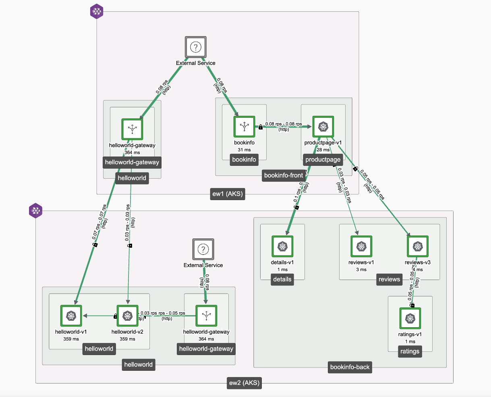

# generate-sidecar-tool

Shamelessly copied from @ZackButcher's work at [generate-authz-tool](https://github.com/ZackButcher/generate-authz-tool).

A simple CLI that calls TSB APIs via HTTP Basic Auth to extract your service topology,
and prints a set of TSB `TrafficSetting` or Istio `Sidecar` objects which have the settings
to allow the calls seen in the service topology. You can later apply them with `tctl`,
or include them as code in your CD pipeline.

## Install

```shell
go install github.com/tetrateio/generate-sidecar-tool
```

And then use the command:

```shell
$ generate-sidecar-tool --help
generate-sidecar-tool: a simple tool for creating Istio Sidecar or TSB TrafficSetting reachability based on the service topology

Usage:
  generate-sidecar-tool [flags]

Flags:
      --debug                       Enable debug logging
      --end string                  End of the time range to query the topology in YYYY-MM-DD format (default "2023-07-28")
  -h, --help                        help for generate-sidecar-tool
  -p, --http-auth-password string   Password to call TSB with via HTTP Basic Auth. REQUIRED
  -u, --http-auth-user string       Username to call TSB with via HTTP Basic Auth. REQUIRED
  -k, --insecure                    Skip certificate verification when calling TSB
      --noverbose                   Disable verbose output; overrides --verbose (equivalent to --verbose=false)
      --org string                  TSB org to query against (default "tetrate")
  -s, --server string               Address of the TSB API server, e.g. some.tsb.address.example.com. REQUIRED
      --start string                Start of the time range to query the topology in YYYY-MM-DD format (default "2023-07-23")
      --verbose                     Enable verbose output, explaining why policy was generated; otherwise only the policy documents are printed. (default true)
```

> Note: Only HTTP Basic Auth is supported today!

Use the CLI to call TSB:

```shell
$ export \
  TSB_USER=YOUR_TSB_USER \
  TSB_PASSWORD=YOUR_TSB_PASSWORD \
  TSB_ADDRESS=YOUR_TSB_UI_ADDRESS

 $ generate-sidecar-tool -k \
    --http-auth-user $TSB_USER \
    --http-auth-password $TSB_PASSWORD \
    --server $TSB_ADDRESS
```

## Examples

Suppose we have the following service graph in TSB:



We can use the tool to call that TSB server and generate a set of policies:

```shell
$ generate-sidecar-tool  -s $TSB_ADDRESS -u $TSB_USER -p $TSB_PASSWORD
no trafficgroup found for source service "organizations/ew-gw-test/services/vmgateway.istio-system", skipping...
no trafficgroup found for source service "organizations/ew-gw-test/services/vmgateway.istio-system", skipping...
no trafficgroup found for source service "organizations/ew-gw-test/services/eastwest-gateway.ewgw", skipping...
no trafficgroup found for source service "organizations/ew-gw-test/services/eastwest-gateway.ewgw", skipping...
no trafficgroup found for source service "organizations/ew-gw-test/services/eastwest-gateway.ewgw", skipping...
no trafficgroup found for source service "organizations/ew-gw-test/services/eastwest-gateway.ewgw", skipping...
no trafficgroup found for source service "organizations/ew-gw-test/services/eastwest-gateway.ewgw", skipping...
no trafficgroup found for source service "organizations/ew-gw-test/services/eastwest-gateway.ewgw", skipping...
apiVersion: networking.istio.io/v1beta1
kind: Sidecar
metadata:
  annotations:
    tsb.tetrate.io/organization: ew-gw-test
    tsb.tetrate.io/tenant: tetrate
    tsb.tetrate.io/trafficGroup: hello
    tsb.tetrate.io/workspace: hello
  name: reachability-sidecar
  namespace: helloworld
spec:
  egress:
  - hosts:
    - istio-system/*
    - xcp-multicluster/*
    - helloworld/*

---
apiVersion: traffic.tsb.tetrate.io/v2
kind: TrafficSetting
metadata:
  group: bok
  organization: ew-gw-test
  tenant: tetrate
  workspace: bookinfo
spec:
  fqn: organizations/ew-gw-test/tenants/tetrate/workspaces/bookinfo/trafficgroups/bok
  reachability:
    hosts:
    - istio-system/*
    - xcp-multicluster/*
    - bookinfo-front/*
    - bookinfo-back/*
```

You can safely redirect the standard output of this tool to a file to get only the YAML contents. The rest of outputs are made into stderr.

### --debug

Prints a _ton_ of additional information, including all calls made to TSB, details of the service graph, and status of the computations the tool is running.

## Limitations

This is a proof of concept; a full version should be built into `tctl`.

- Only HTTP Basic Auth is supported; production deployments of TSB require OAuth or similar, so this is largly only good for demo
- If a Service is not selected by a Group (i.e. just inherits Workspace config), nothing is returned by TSB's `Lookup` API. We don't try to figure out the Workspace of Services without Groups, so no policy is generated for them. Future work would get a list of the Workspaces, and query their selectors to determine the Workspaces for each service without a Group. (Or the Services `Lookup` call can be updated to return Workspace in addition to Groups.)
- If a traffic group that claims the source namespace of a call does not exist, the call will be skipped.
